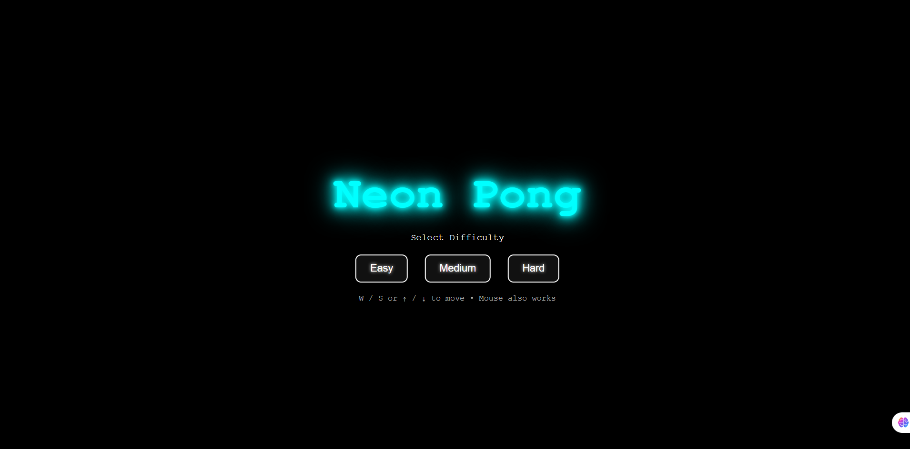

# Neon Pong 🎮

Neon Pong is a modern and visually striking take on the classic Pong game, built using **HTML, CSS, and JavaScript**. The game features neon aesthetics, smooth gameplay, and adjustable difficulty levels.

## Features

- **Start Screen** with neon glowing title and difficulty buttons.
- **Difficulty Modes**: Easy, Medium, Hard — adjust AI reaction speed.
- **Keyboard & Mouse Controls**:  
  - W / S or Arrow Up / Down to move the paddle.  
  - Mouse movement also works.
- **Animated Gradient Background** for a futuristic neon effect.
- **Realistic Ball Physics**: Collision with paddles and walls. Ball speed increases over time.
- **Score Display**: Scores are shown inside the canvas.

## How to Play

1. Open `index.html` in your browser.
2. On the start screen, select a difficulty: **Easy**, **Medium**, or **Hard**.
3. Control your paddle using either:
   - **Keyboard**: W / S or Arrow Up / Down  
   - **Mouse**: Move up/down on the canvas
4. Prevent the ball from passing your paddle. The ball speeds up gradually.
5. Scores are tracked in real-time inside the canvas.

## Installation

1. Clone the repository or download the files.
2. Open `index.html` in your favorite web browser.
3. Enjoy playing Neon Pong!

## Technologies Used

- HTML5 Canvas
- CSS3 (Neon Effects & Animations)
- JavaScript (Game Logic & AI)

## Demo

## License

This project is open-source and free to use.

